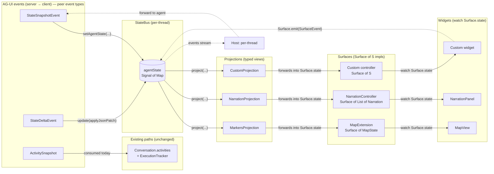
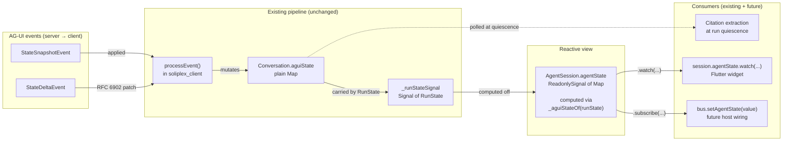
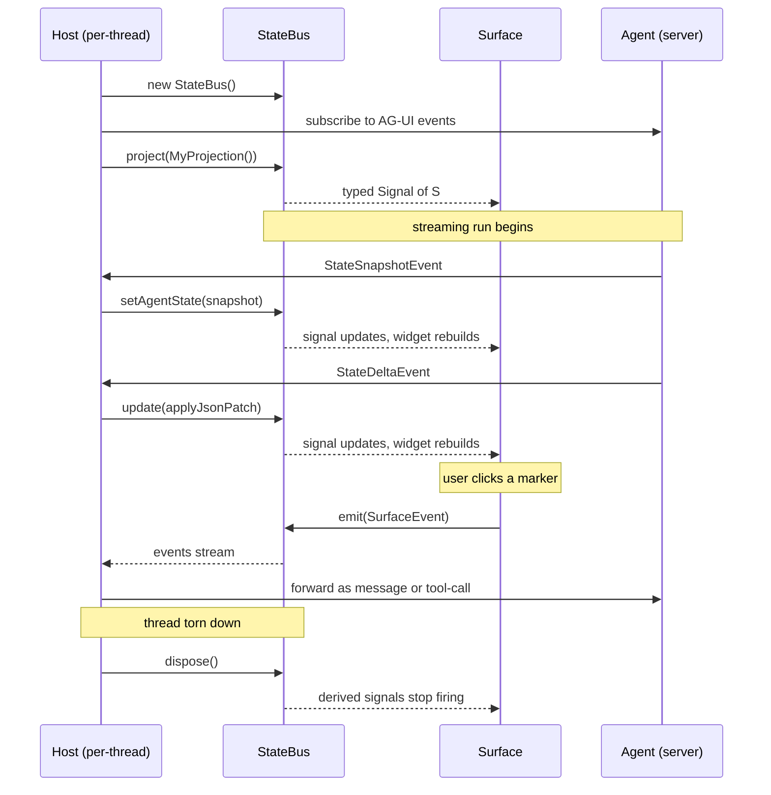
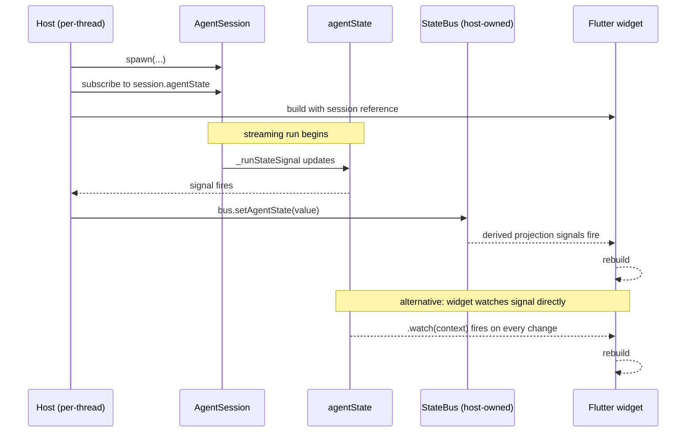

# ADR-001: Reactive State Management via Scoped StateBus and Ownership-Based Discovery

- **Status:** Accepted
- **Date:** 2026-04-27
- **Authors:** Alan Runyan, William Karol Di Cioccio
- **Supersedes:** —
- **Superseded by:** —

---

## 1. Context and Problem Statement

### The surface proliferation problem

Soliplex streams structured agent state to the client as a live JSON document.
As GenUI surfaces multiply — maps, narration panels, HUDs, interactive
widgets — each surface needs a reactive, typed slice of that document. Without
a shared contract, each view independently subscribes to the raw AG-UI event
stream, re-parses the state, and manages its own lifecycle. The resulting
duplication is not merely redundant: it distributes the risk of subscription
leaks and mismatched parse logic across every surface implementor.

### The reactivity gap in the existing pipeline

`processEvent()` in `soliplex_client` already applies `StateSnapshotEvent`
(full replacement) and `StateDeltaEvent` (RFC 6902 JSON Patch) into
`Conversation.aguiState`. However, `Conversation.aguiState` was a plain
`Map<String, dynamic>` field — a value, not an observable. View layers had
no standard mechanism to watch it for changes. The only production read of
the field happened at run quiescence (citation extraction), which is a
pull-at-boundary pattern, not a reactive one.

Any surface that wanted live updates had to subscribe to `_runStateSignal`
directly, pattern-match the sealed `RunState` hierarchy, and extract
`aguiState` manually — per-variant boilerplate that each implementor wrote
differently.

### Lifecycle management without RAII

Dart is a garbage-collected language with no deterministic destructors. There
is no language-level analogue to C++'s RAII or Swift's `deinit` that fires
the moment a scope exits. This creates a structural risk for reactive
systems: subscriptions and derived signals outlive their intended scope unless
explicitly torn down.

In a multi-surface, multi-thread application where buses are created and
destroyed as threads open and close, the two failure modes are symmetric:

- **Too early:** A surface reads a bus that has been disposed; it observes
  stale or empty state, or receives an exception on signal access.
- **Too late:** A bus that should have been disposed is retained by a
  lingering projection or subscriber; listeners continue to fire, and heap
  pressure accumulates silently.

Because the language provides no mechanistic guarantee, the design must
establish a contractual one.

---

## 2. Proposed Solution: The Reactive Chain

The solution is a three-layer reactive chain. Each layer has a single
responsibility; together they carry agent state from the server event stream
to a typed Flutter widget rebuild.



### Layer 1 — Source: `AgentSession.agentState`

`AgentSession` exposes a computed signal derived from the existing
`_runStateSignal`:

```dart
late final ReadonlySignal<Map<String, dynamic>> agentState = computed(
  () => _aguiStateOf(_runStateSignal.value) ?? const {},
);

static Map<String, dynamic>? _aguiStateOf(RunState state) =>
    switch (state) {
      RunningState(:final conversation)     => conversation.aguiState,
      ToolYieldingState(:final conversation) => conversation.aguiState,
      CompletedState(:final conversation)   => conversation.aguiState,
      FailedState(:final conversation)      => conversation?.aguiState,
      CancelledState(:final conversation)   => conversation?.aguiState,
      IdleState()                            => null,
    };
```

The switch is exhaustive over the sealed `RunState` hierarchy. Adding a new
variant forces a compile error here, so the reactive bridge stays correct as
the state machine evolves — correctness is structural, not documentary.

The signal returns an empty map (not null) for idle and terminal-without-
conversation states, so downstream consumers need no null guards.



### Layer 2 — Transport: `StateBus`

`StateBus` is a scope-agnostic reactive document with four operations:

| Operation | Purpose |
| --------- | ------- |
| `setAgentState(map)` | Full snapshot replacement |
| `update(fn)` | Delta application (JSON Patch) |
| `project<S>(projection)` | Derive a typed `ReadonlySignal<S>` |
| `emit(event)` | Write-back path (surface → agent) |

Two invariants are enforced internally:

- **Snapshot semantics on read:** `agentState`'s value is always
  `Map.unmodifiable(...)`. Callers cannot mutate what they read, preventing
  aliasing bugs across projections.
- **Identity change on every replacement:** Even structurally equal maps
  produce a new wrapping identity, so `Signal` listeners always fire.
  Equality optimisation is explicitly out of scope; correctness is preferred
  over efficiency until profiling proves otherwise.

### Layer 3 — Consumption: `StateProjection<S>`

```dart
abstract class StateProjection<S> {
  S project(Map<String, dynamic> agentState);
}
```

A pure, idempotent transform. Projections must be tolerant: malformed or
partial state (common during streaming) must produce a sensible empty or null
value, never throw. The bus owns derived signals returned by `project<S>`;
callers must not dispose them manually.

---

## 3. Key Design Decisions

### 3.1 No global registry

`StateBus` has no `all` static list, no `BusRegistry`, and no app-wide
observable of active buses. This was a deliberate rejection, not an
oversight.

A global registry introduces two failure modes that are difficult to reason
about in a GC language:

- **Lifetime coupling:** A registry must either retain disposed buses (memory
  leak) or require each bus to deregister on disposal (cross-ownership cleanup
  that races against the owning scope's teardown).
- **Implicit dependency surface:** A `BusRegistry.all` observable invites
  consumers to subscribe to "every bus, any change" — a dependency that is
  invisible in the type system and impossible to trace statically.

Debug introspection — the only legitimate use case for a flat list — is a
separate concern. A diagnostic tool that walks ownership at a point in time is
the correct solution; it should not be a runtime cost paid by every bus in
production.

### 3.2 Ownership-based discovery

Discovery follows ownership. The rule is:

> To find a bus, walk to its owner. To find a thread's bus, call
> `runtime.threadStateOf(key)?.bus`. Do not search; navigate.

This policy is the contractual substitute for RAII. Because Dart cannot
enforce "the bus dies when its owner dies" at the language level, the design
makes ownership explicit and observable:

| Bus scope | Owner | Discovery path |
| --------- | ----- | -------------- |
| App | Shell | `shell.appBus` |
| Server | `AgentRuntime` | `runtime.serverBus[serverId]` |
| Room | Per-room view state | `runtime.roomStateOf(key)?.bus` |
| Thread | Per-thread state | `runtime.threadStateOf(key)?.bus` |

Code that holds a `StateBus` reference obtained via a direct constructor call
— rather than via ownership navigation — is in violation of this policy and
should be treated as a defect in review.

### 3.3 Terminal disposal

`bus.dispose()` is the idempotent kill switch for a bus and all signals
derived from it:

- Closes the `events` broadcast stream.
- Disposes the underlying `agentState` signal.
- Stops all derived projection signals from firing.
- Is safe to call multiple times.

The host is the absolute owner of this call. No surface, projection, or
widget should call `bus.dispose()`. The invariant: **the entity that
constructed the bus is the entity that disposes it.**

### 3.4 Exhaustive state mapping

The `_aguiStateOf` switch in `AgentSession` is over a sealed class. This is
not stylistic preference — it is a compile-time contract that the reactive
bridge handles every current and future `RunState` variant. When the state
machine gains a new variant, the compiler rejects a build that omits it from
the switch. Correctness is enforced structurally, not by convention.

---

## 4. Consequences and Caveats

### 4.1 Manual lifecycle responsibility (the host contract)

The design intentionally places lifecycle responsibility on the **Host** —
the per-thread (or per-scope) entity that constructs and disposes the bus.
This is the explicit trade: in exchange for no global registry, the host must
be disciplined. The host contract is:



```text
host
  ├── new StateBus()                  ← when scope becomes active
  ├── feed state events:
  │     bus.setAgentState(snapshot)   ← StateSnapshotEvent
  │     bus.update(applyJsonPatch)    ← StateDeltaEvent
  ├── for each surface:
  │     final s = bus.project(MyProjection());
  │     controller.bindToSignal(s);
  ├── listen to bus.events            ← write-back forwarding
  └── bus.dispose()                   ← when scope tears down
```

Failure to call `bus.dispose()` before the owning scope exits is a resource
leak. Code review and static analysis tooling should treat the absence of a
paired `dispose()` call as a defect.

### 4.2 Cross-scope projection composition (opt-in risk)

The architecture explicitly supports projections that compose state from
multiple buses at different scopes (e.g., a summary widget that reads the
server-bus thread list and the active thread-bus's last message). This
capability is opt-in and carries a non-trivial risk:

- Each composed bus has an independent owner and lifetime. A projection that
  holds references to two buses may observe one disposed and one active.
- Projections must defensively handle the case where a composed bus has been
  disposed. The `null`-returning pattern for missing state is the correct
  model.

Cross-scope composition bypasses the standard isolation boundary. Treat it as
an advanced capability requiring explicit justification in code review.

### 4.3 Host wiring — connecting `agentState` to a `StateBus`

The sequence below shows the handoff from `AgentSession.agentState` (the
reactive source) through a host-owned `StateBus` to a Flutter widget. It
illustrates why the host is the correct locus of ownership: it is the only
entity that has references to both the session and the bus simultaneously.



### 4.4 Stale references without RAII

Because Dart provides no deterministic destruction, there is no language
guarantee that a `StateBus` reference becomes unreachable the moment its owner
is torn down. Code that obtains a bus reference through a mechanism other than
ownership navigation (e.g., captured in a closure, stored in a widget's
`State`) must verify liveness before use:

```dart
// Prefer: navigate ownership each time
final bus = runtime.threadStateOf(key)?.bus;
if (bus == null) return; // owner gone

// Avoid: long-lived capture of a bus reference
final _bus = widget.bus; // may be disposed when widget rebuilds
```

The `?.bus` navigation pattern is not merely ergonomic — it is the
liveness check. A null return from ownership navigation means the scope has
been torn down; callers must treat that as a terminal condition, not a
transient error.

---

## 5. Alternatives Considered

### 5.1 Global event bus

A single app-wide `StreamController<AgentStateEvent>` that all surfaces
subscribe to. Rejected because:

- Lifetime is unbounded — subscribers from a closed thread continue to
  receive events from all other threads until manually unsubscribed.
- The event stream carries no scope identity by default, requiring every
  subscriber to filter by thread key — a filtering step each implementor
  would write differently.
- Disposal becomes a coordination problem: who closes the stream, and when?

### 5.2 Central bus registry (`StateBus.all`)

A static `Map<ScopeKey, StateBus>` maintained by the framework. Rejected
for the reasons in §3.1: lifetime coupling and implicit dependency surface.
The registry either leaks disposed buses or requires cross-ownership cleanup
that races. Neither failure mode is acceptable in a multi-thread UI.

### 5.3 Riverpod `AsyncNotifier` / `FutureProvider` chains

Riverpod is used in this codebase as a DI/service locator only — no
`AsyncNotifier` or `FutureProvider` chains. Extending Riverpod to own reactive
state would blur the architectural boundary between DI and reactivity, and
would couple the state layer to Riverpod's invalidation semantics, which are
designed for async data fetching rather than streaming patch application.
`signals` is the chosen reactivity primitive; `StateBus` is its
domain-specific wrapper.

### 5.4 `ChangeNotifier` / `ValueNotifier`

Flutter's built-in notifiers are listener-list based and have no notion of
derived signals or projection composition. They also leak if `removeListener`
is not called, which replicates the exact problem the ownership policy is
designed to prevent. Rejected in favour of the `signals` package, whose
computed-signal model supports projection composition natively.

---

## 6. Summary

| Property | Decision |
| -------- | -------- |
| Reactivity primitive | `signals` computed signal |
| State source | `AgentSession.agentState` (computed off `_runStateSignal`) |
| Transport | `StateBus` (per-scope, owner-constructed) |
| Projection | `StateProjection<S>` (pure, tolerant, idempotent) |
| Discovery policy | Ownership navigation; no global registry |
| Disposal contract | Host constructs → host disposes; `dispose()` is idempotent |
| State correctness guarantee | Exhaustive sealed-class switch in `_aguiStateOf` |
| Cross-scope composition | Opt-in; caller accepts dual-lifetime risk |
| RAII substitute | Ownership-based discovery + explicit host contract |
