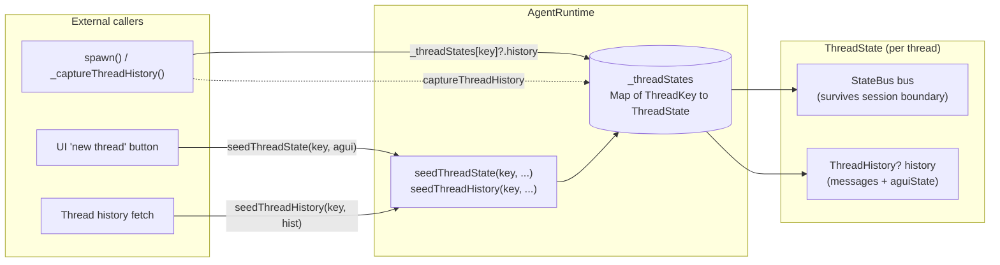

# `AgentRuntime` per-thread state — `ThreadState` and `ThreadKey` keying

Replaces the old `_threadHistories: Map<String, ThreadHistory>` cache
with `_threadStates: Map<ThreadKey, ThreadState>` and introduces
`ThreadState` as the per-thread bundle holder.

## What problem this solves

Two issues with the prior cache:

1. **Latent bug**: `_threadHistories` was keyed by bare `threadId`
   (a `String`). In a multi-room runtime, two rooms could in
   principle issue the same `threadId` and the cache wouldn't catch
   the collision. Today `AgentRuntime` is per-server so the bug is
   masked, but the typing didn't enforce uniqueness.
2. **No place for a per-thread `StateBus`**: the redesign needs each
   thread to own a `StateBus` that survives session boundaries. The
   plain `ThreadHistory` cache had no slot for it.

This commit fixes both: keying moves from `String` to the full
`ThreadKey` triple `(serverId, roomId, threadId)`, and the cache's
value type becomes `ThreadState(StateBus bus, ThreadHistory? history)`
— a slot for both.

## Data flow



The bus survives across session attach / detach within a thread's
lifetime. The history field carries the cached messages + aguiState
that prior sessions left behind.

## Why ThreadKey, not bare threadId

```dart
// Before — bare String key
final Map<String, ThreadHistory> _threadHistories = {};

void seedThreadState(String threadId, Map<String, dynamic> aguiState) {
  // ... two rooms with the same threadId would collide silently
}

// After — full ThreadKey record
final Map<ThreadKey, ThreadState> _threadStates = {};

void seedThreadState(ThreadKey key, Map<String, dynamic> aguiState) {
  // ThreadKey value-equality enforces uniqueness across the triple
}
```

`ThreadKey` is the existing typedef record
`(String serverId, String roomId, String threadId)` — Dart's record
value-equality makes it a valid `Map` key out of the box.

## Why a `ThreadState` class instead of just `Map<ThreadKey, StateBus>`

Two reasons:

1. **Composite slot**: a thread needs both a `StateBus` (for live
   reactive state) and a `ThreadHistory?` (for cached messages +
   aguiState used during resume). Wrapping both into one
   per-thread bundle keeps the runtime's spawn-path simple.
2. **Lifecycle**: `ThreadState.dispose()` disposes the bus
   idempotently. The runtime's `dispose()` calls
   `state.dispose()` on every entry, ensuring every per-thread bus
   is released.

```dart
@immutable
class ThreadState {
  ThreadState({StateBus? bus, this.history}) : bus = bus ?? StateBus();

  final StateBus bus;
  final ThreadHistory? history;

  ThreadState withHistory(ThreadHistory? next) =>
      ThreadState(bus: bus, history: next);

  void dispose() => bus.dispose();
}
```

`withHistory` returns a copy with a different `history` while
preserving the same `bus` (so live signal subscriptions keep
working). The class is `@immutable` for the same reason `Conversation`
is — value-typed updates make reasoning about state transitions
easier.

## What this PR ships

- **New file**: `packages/soliplex_agent/lib/src/runtime/thread_state.dart`
  (~50 LOC) — the `ThreadState` class.
- **Modified**: `packages/soliplex_agent/lib/src/runtime/agent_runtime.dart`
  - `_threadHistories: Map<String, ThreadHistory>` →
    `_threadStates: Map<ThreadKey, ThreadState>`.
  - `seedThreadState(threadId, ...)` → `seedThreadState(key, ...)`.
  - `seedThreadHistory(threadId, ...)` → `seedThreadHistory(key, ...)`.
  - Both seed methods now also seed the `bus` from `aguiState`, so
    the bus is populated when a session is later spawned.
  - `_captureThreadHistory` writes via `withHistory` (immutable
    update preserving the bus).
  - `dispose` disposes all per-thread buses.
- **Modified**: `packages/soliplex_agent/lib/soliplex_agent.dart` —
  re-exports `thread_state.dart`.
- **Modified callers**:
  - `lib/src/modules/room/room_state.dart` — passes full `ThreadKey`
    to `seedThreadState`/`seedThreadHistory` (constructed from
    `(_connection.serverId, _roomId, threadId)`).
  - `packages/soliplex_agent/test/runtime/agent_runtime_test.dart` —
    same, in the test fixtures.

## Breaking change

`AgentRuntime.seedThreadState` and `AgentRuntime.seedThreadHistory`
change their first parameter type from `String` to `ThreadKey`.

| Call site | Before | After |
| --- | --- | --- |
| `lib/src/modules/room/room_state.dart` | `runtime.seedThreadHistory(id, history)` | `runtime.seedThreadHistory((serverId: ..., roomId: ..., threadId: id), history)` |
| `packages/soliplex_agent/test/runtime/agent_runtime_test.dart` | `runtime.seedThreadState(_threadId, initialState)` | `runtime.seedThreadState((serverId: 'default', roomId: _roomId, threadId: _threadId), initialState)` |

Two callers in the monorepo. Both updated in this PR.

## Test plan

- [x] `flutter analyze` — 0 issues
- [x] `flutter test packages/soliplex_agent/test/runtime/agent_runtime_test.dart` —
  46/46 pass (existing tests unaffected by the keying change since
  they just construct ThreadKey records inline now)
- [x] `dart format` — clean
- [x] `markdownlint-cli2 docs/agent-runtime-thread-state.md` — clean

## Stack position

Base: `feat/agent-state-signal` (PR #190 — `AgentSession.agentState`
reactive signal). Depends on the `StateBus` type from PR #189
indirectly (already present via the parent stack).

This is the structural prerequisite for follow-up PRs that route
AG-UI events through the bus — once `_threadStates` is keyed by
`ThreadKey` and each entry owns a bus, the next PR (`AgentSession`
forwards state changes into `bus.setAgentState(...)`) has a natural
target.

## What this PR explicitly does NOT ship

- No bus-write integration in `AgentSession._onStateChange` — the
  bus is constructed and seeded but no AG-UI events route through
  it yet. That's the next stacked PR.
- No `AgentSession.bus` getter — the runtime has the buses but
  sessions don't expose them yet.
- No `Conversation` per-thread scope move. `Conversation` is still
  per-session; `ThreadHistory` is the carry-forward field.
- No projection registrations or surface wiring — those are
  consumer concerns in plugin packages, not runtime concerns.
