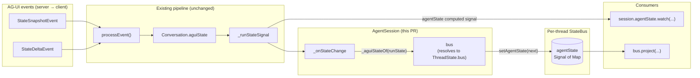

# `AgentSession.bus` and bus-routed AG-UI state events

Closes the loop between `AgentSession`'s state-change pipeline and
the per-thread `StateBus` introduced by the `ThreadState` PR.

## What this PR does

Two related additions to `AgentSession`:

1. A **`bus` getter** that resolves through
   `runtime.ensureThreadState(threadKey).bus`. Every session sees
   the per-thread bus that survives session boundaries.
2. **`_onStateChange` now writes the bus** on every state-altering
   transition. AG-UI `StateSnapshotEvent` and `StateDeltaEvent` are
   already applied to the conversation by `processEvent`; this
   propagates the result into the bus so bus consumers (projections,
   render targets) see it on every event.

## Data flow



The "existing pipeline" subgraph is unchanged. What this PR adds is
the connection from `_onStateChange` into the bus's
`setAgentState(...)`. After this lands, two read paths to the agent
state exist:

- **`session.agentState`** (per-session computed signal, P1 from the
  `feat/agent-state-signal` PR) — updates on every `RunState` change.
- **`bus.agentState`** (per-thread bus signal, this PR plus the
  `feat/agent-runtime-threadkey` PR) — updates on the same events,
  but lives on the per-thread bus that survives session boundaries.

The bus path is what plugin code uses to read derived state via
`bus.project(...)`.

## Why both signals?

In v1 they're not redundant — they have different scopes:

- `session.agentState` is alive only while the session is alive.
  When the session disposes, the signal disposes.
- `bus.agentState` lives at thread scope. Multiple sessions on the
  same thread see the same bus.

A future PR makes `session.agentState` a view of `bus.agentState`
(reading from the per-thread bus rather than computing off
`_runStateSignal`), eliminating the parallel-compute path. That's
out of scope here.

## What this PR ships

- `packages/soliplex_agent/lib/src/runtime/agent_runtime.dart` —
  adds public `threadStateOf(key)` and `ensureThreadState(key)`
  accessors. The latter is used by `AgentSession.bus`.
- `packages/soliplex_agent/lib/src/runtime/agent_session.dart` —
  - Adds a `bus: StateBus` getter resolving through
    `_runtime.ensureThreadState(threadKey).bus`. Late-evaluated
    so a session that never reads `bus` never causes a
    `StateBus` to be constructed.
  - `_onStateChange` extracts `_aguiStateOf(runState)` and forwards
    to `bus.setAgentState(next)`.

## What this PR explicitly does NOT ship

- No SessionContext type — this PR adds a `bus` getter on the
  session, but doesn't introduce a wider context object passed to
  handlers. SessionContext lands later when plugin handlers need
  it.
- No `session.agentState` rewrite as a bus view — that's a follow-up.
  Both signals exist in parallel for now.
- No projection registrations or surface wiring — those are consumer
  concerns in plugin packages.

## Stack position

```text
main
  └── feat/genui-state-bus-types         (PR #189) — Surface / StateProjection / StateBus
       └── feat/agent-state-signal       (PR #190) — AgentSession.agentState signal
            └── feat/agent-runtime-threadkey  (PR #191) — ThreadState + ThreadKey keying
                 └── feat/session-bus-route   (this PR) — bus getter + bus-write
```

## Test plan

- [x] `flutter analyze` — 0 issues
- [x] `flutter test packages/soliplex_agent` — passes (mocks need
  `ensureThreadState` stubbed; fixtures updated)
- [x] `dart format` — clean
- [x] `markdownlint-cli2 docs/agent-session-bus-route.md` — clean
