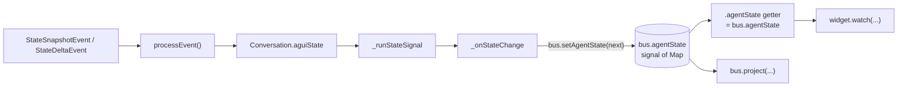

# `AgentSession.agentState` as a view of the bus

Cleanup PR. Eliminates the parallel-compute path for the `agentState`
signal now that the per-thread bus is the canonical source of truth
for agent state.

## Before

```dart
late final ReadonlySignal<Map<String, dynamic>> agentState = computed(() {
  final state = _runStateSignal.value;
  return _aguiStateOf(state) ?? const <String, dynamic>{};
});
```

`agentState` was a `computed()` derivation off `_runStateSignal`. It
extracted the conversation's `aguiState` via the exhaustive
`_aguiStateOf` switch, which was the original P1 plumbing.

## After

```dart
late final ReadonlySignal<Map<String, dynamic>> agentState = bus.agentState;
```

A direct view of `bus.agentState`. Same value, single source of truth.

## Why this is now safe

After PR #192 (`feat/session-bus-route`), `_onStateChange` writes the
bus on every `RunState` transition. So `bus.agentState.value` is
guaranteed to reflect the same snapshot the prior `computed()` would
have produced — they were both reading the same conversation by
different paths.

Removing the `computed()` wrapper:

- **One signal subscription chain**, not two.
- **No risk of a future RunState variant accidentally being missing
  from the `_aguiStateOf` switch** while the bus path keeps working
  (or vice versa).
- **One source of truth for projections and direct watchers.** A
  widget that does `session.agentState.watch(context)` and a
  projection that does `bus.project(...)` see the exact same data,
  through the exact same signal.

## Data flow after this PR



The `_aguiStateOf` switch lives on inside `_onStateChange` (it still
extracts the conversation's `aguiState` to pass into
`bus.setAgentState`). It just no longer powers a parallel
`computed()`.

## What this PR ships

- `packages/soliplex_agent/lib/src/runtime/agent_session.dart` —
  collapses `agentState` from `computed()` to `bus.agentState`. Net
  diff: ~5 LOC.
- `docs/agent-state-as-bus-view.md` — this doc.

## What this PR explicitly does NOT ship

- No removal of `_aguiStateOf` — it still does useful work in
  `_onStateChange` (extracting the conversation's aguiState to
  forward to the bus).
- No `Conversation.aguiState` removal — the field stays as the
  underlying source. This PR just stops *reading* it twice.
- No projection registrations or surface wiring.

## Stack position

```text
main
  └── feat/genui-state-bus-types       (PR #189)
       └── feat/agent-state-signal     (PR #190)
            └── feat/agent-runtime-threadkey  (PR #191)
                 └── feat/session-bus-route  (PR #192)
                      └── feat/agent-state-view-of-bus  (this PR)
```

## Test plan

- [x] `flutter analyze` — 0 issues
- [x] `flutter test` (agent_session_test.dart + agent_session_signal_test.dart) — 44/44 pass
- [x] `dart format` — clean
- [x] `dcm analyze` — no issues
- [x] `markdownlint-cli2` — clean

The existing `agent_session_signal_test.dart` cases covering
`agentState` for Idle / StateSnapshotEvent / StateDeltaEvent
continue to pass — they exercise the same data flow, now through
one signal instead of two.
