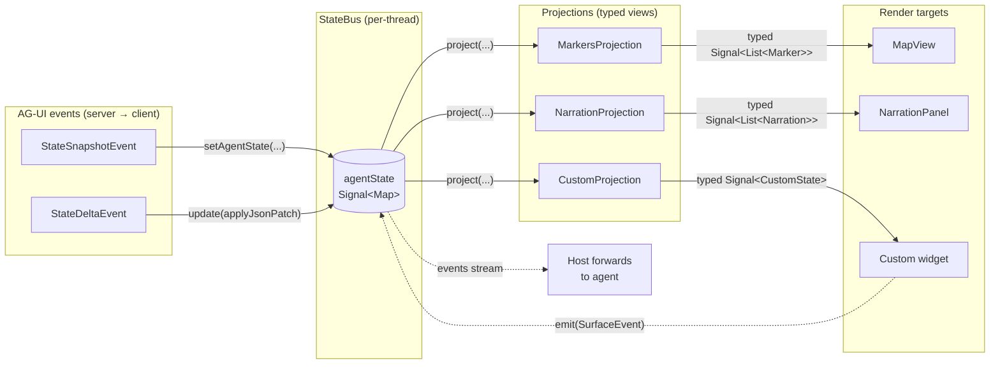

# StateBus, Surface, and StateProjection

Pure-Dart contract that lets multiple rendered surfaces (a map, a
narration log, a HUD, future JS-bridged widgets, charts, ...) be driven
from a single reactive agent-state map per thread.

This doc covers the three primitives introduced in
`soliplex_client/lib/src/`:

- `StateBus` (`application/state_bus.dart`) — per-thread reactive bus.
- `Surface<S>` (`domain/surface.dart`) — view-layer controller contract.
- `StateProjection<S>` (`domain/surface.dart`) — pure transform from
  raw state to typed surface state.

These are **primitives**. They have no Flutter dependency, no agent
dependency, and no behavioral coupling. They sit alongside the existing
AG-UI event processor and become the seam between AG-UI's state events
and the GenUI surface layer.

## What problem they solve

A streaming agent emits two structured channels next to its message
stream:

- `StateSnapshotEvent` — a full agent-state replacement.
- `StateDeltaEvent` — a JSON Patch applied to the existing state.

Today both channels feed `Conversation.aguiState`, which any number of
view layers may want to subscribe to. Without a shared contract, each
view re-implements its own subscribe / parse / render pipeline. With
the primitives below:

- The host (typically a thread view) constructs one `StateBus` per
  active thread and feeds AG-UI events into it.
- Each surface (map, narration log, etc.) registers a
  `StateProjection<S>` and receives a `ReadonlySignal<S>` it can watch.
- The bus also accepts surface-originated events (`SurfaceEvent`) for
  the eventual write-back path (an interactive widget tells the agent
  the user clicked a marker).

No new logic; just one well-typed boundary.

## Data flow



Solid arrows are read-side data flow (state events → bus → projections
→ widgets). Dashed arrows are write-back (a surface emitting events
the host forwards to the agent).

## `StateBus`

```dart
class StateBus {
  StateBus({Map<String, dynamic> initialAgentState = const {}});

  ReadonlySignal<Map<String, dynamic>> get agentState;
  Stream<SurfaceEvent> get events;

  void setAgentState(Map<String, dynamic> next);
  void update(Map<String, dynamic> Function(Map<String, dynamic>) transform);
  void emit(SurfaceEvent event);

  ReadonlySignal<S> project<S>(StateProjection<S> projection);

  void dispose();
}
```

Key behaviors:

- **Snapshot semantics on read** — `agentState`'s value is always a
  frozen (`Map.unmodifiable`) view of the most recent state. Callers
  cannot mutate what they read.
- **Identity changes on every replacement** — even when delta
  application produces structurally-equal maps, the wrapping
  identity changes so `Signal` listeners always fire.
- **`project<S>(...)` returns a derived signal** that recomputes on
  every state change. The bus owns the returned signal; do not
  `dispose()` it manually.
- **Events stream is broadcast** — surfaces emit via `Surface.emit`
  (which calls `bus.emit(...)` by default); host code subscribes to
  `bus.events` and forwards toward the agent.
- **Idempotent disposal** — `dispose()` closes the events stream and
  disposes the underlying signal so derived projections also stop.

## `Surface<S>`

```dart
abstract class Surface<S> {
  String get id;
  ReadonlySignal<S> get state;
  void emit(SurfaceEvent event) {}
}
```

A long-lived controller (e.g. `mapExtension`, `narrationController`,
or a future per-message widget) with a stable `id` and a typed
read-only signal `state`. The default `emit` is a no-op; interactive
surfaces override it to forward `SurfaceEvent`s to whichever bus they
were registered against.

## `StateProjection<S>`

```dart
abstract class StateProjection<S> {
  S project(Map<String, dynamic> agentState);
}
```

A pure, idempotent function from raw agent-state to typed surface
state. Examples (in dependent packages):

- `RagSnapshotProjection extends StateProjection<RagSnapshot?>` —
  wraps the existing `RagSnapshot.fromJson` dispatch as a projection
  (included as a conformance test that the abstraction fits existing
  code).

Projections must be tolerant: bad shapes should produce a sensible
empty / null value, never throw. The agent may emit partial state
during streaming.

## `SurfaceEvent`

A typed write-back envelope:

```dart
@immutable
class SurfaceEvent {
  const SurfaceEvent({
    required this.surfaceId,
    required this.kind,
    this.data = const {},
  });

  final String surfaceId;
  final String kind;
  final Map<String, dynamic> data;
}
```

Surfaces emit one when the user interacts with the rendered view
(e.g. clicking a marker, dragging a slider, selecting a row). The
host consumes from `bus.events` and forwards to the agent — as a
synthetic chat message, a structured tool-call argument, or a future
dedicated AG-UI client→server frame.

## Lifecycle

```mermaid
sequenceDiagram
    participant Host as Host (per-thread)
    participant Bus as StateBus
    participant Surf as Surface
    participant Agent as Agent (server)

    Host->>Bus: new StateBus()
    Host->>Agent: subscribe to AG-UI events
    Host->>Bus: bus.project(MyProjection())
    Bus-->>Surf: typed Signal&lt;S&gt;

    Note over Agent,Bus: streaming run begins
    Agent->>Host: StateSnapshotEvent
    Host->>Bus: setAgentState(snapshot)
    Bus-->>Surf: signal updates → widget rebuilds

    Agent->>Host: StateDeltaEvent
    Host->>Bus: update(applyJsonPatch)
    Bus-->>Surf: signal updates → widget rebuilds

    Note over Surf: user clicks a marker
    Surf->>Bus: emit(SurfaceEvent)
    Bus-->>Host: events stream
    Host->>Agent: forward as message / tool-call

    Note over Host,Bus: thread torn down
    Host->>Bus: dispose()
    Bus-->>Surf: derived signals stop firing
```

Equivalent ASCII summary:

```text
host (per-thread)
  ├── new StateBus()                  ← when thread becomes visible
  ├── feed AG-UI events:
  │     bus.setAgentState(snapshot)   ← StateSnapshotEvent
  │     bus.update(applyJsonPatch)    ← StateDeltaEvent
  ├── for each surface:
  │     final s = bus.project(MyProjection());
  │     myController.bindToSignal(s);  ← surface-specific
  ├── listen to bus.events            ← write-back
  └── bus.dispose()                   ← when thread is torn down
```

## What this commit ships

- `StateBus`, `Surface<S>`, `StateProjection<S>`, `SurfaceEvent` — the
  four primitives.
- `RagSnapshotProjection` — a single conformance projection in
  `soliplex_client` proving the abstraction wraps existing code
  cleanly.
- Unit tests for `StateBus` covering snapshot replacement, delta
  application, projection recomputation, event emission, and
  disposal idempotence.

No callers of these types yet exist in `soliplex_client` itself —
they're primitives that follow-on work in `soliplex_agent` and the
app shell will consume.

## What's intentionally NOT in this commit

- Behavioral changes — no existing code path is modified.
- A second projection beyond `RagSnapshotProjection` — others ship in
  the packages where their typed result lives (e.g. map projections
  in `soliplex_agent_maps`).
- The `AgentSession.agentState` reactive signal — that's a follow-up
  in `soliplex_agent` that consumes these primitives.
- Bus-write integrations into `RunOrchestrator` — same; downstream of
  the primitives.

This commit is foundation only. Reviewers should focus on the type
surface and snapshot/delta/event/projection semantics.
