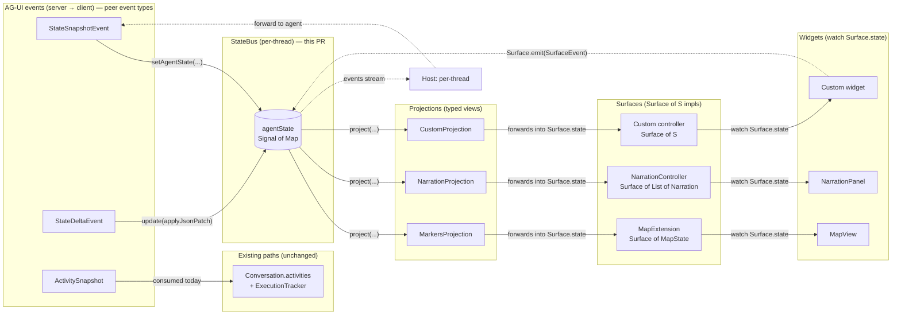
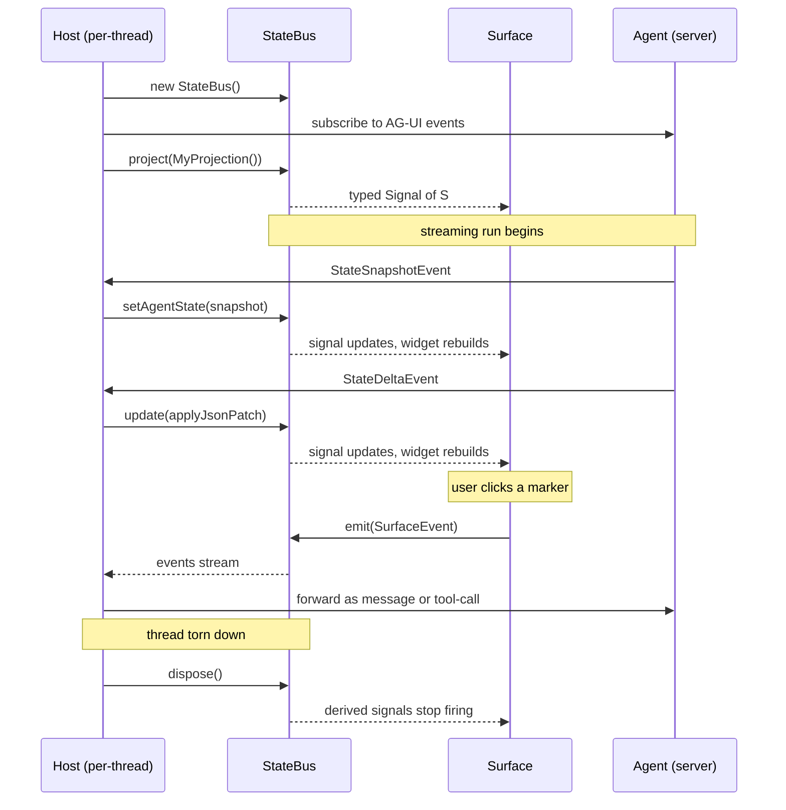

# StateBus, Surface, and StateProjection

Pure-Dart contract that lets multiple rendered surfaces (a map, a
narration log, a HUD, future JS-bridged widgets, charts, ...) be driven
from a single reactive agent-state map per thread.

This doc covers the three primitives introduced in
`soliplex_client/lib/src/`:

- `StateBus` (`application/state_bus.dart`) — per-thread reactive bus.
- `Surface<S>` (`domain/surface.dart`) — view-layer controller contract.
- `StateProjection<S>` (`domain/surface.dart`) — pure transform from
  raw state to typed surface state.

These are **primitives**. They have no Flutter dependency, no agent
dependency, and no behavioral coupling. They sit alongside the existing
AG-UI event processor and become the seam between AG-UI's state events
and the GenUI surface layer.

## What problem they solve

A streaming agent emits several structured channels alongside the
message stream:

- `StateSnapshotEvent` — a full agent-state replacement.
- `StateDeltaEvent` — a JSON Patch applied to the existing state.
- `ActivitySnapshot` — a structured activity record (typed activity,
  content map, timestamp, replace flag) — currently consumed by the
  per-session `ExecutionTracker` and `Conversation.activities`, not
  by the bus. (See "Scope of this PR" below.)
- `RunStarted` / `RunFinished` / `RunError` lifecycle frames, plus
  the streaming-text and tool-call events.

This PR's `StateBus` handles **the state channel** — `StateSnapshotEvent`
and `StateDeltaEvent`. It is the shared subscription point for view
layers that need to render derived state.

Today the state channel feeds `Conversation.aguiState`, which any
number of view layers may want to subscribe to. Without a shared
contract, each view re-implements its own subscribe / parse / render
pipeline. With the primitives below:

- The host (typically a thread view) constructs one `StateBus` per
  active thread and feeds AG-UI events into it.
- Each surface (map, narration log, etc.) registers a
  `StateProjection<S>` and receives a `ReadonlySignal<S>` it can watch.
- The bus also accepts surface-originated events (`SurfaceEvent`) for
  the eventual write-back path (an interactive widget tells the agent
  the user clicked a marker).

No new logic; just one well-typed boundary.

## Data flow



**AG-UI peers:** the server emits three structured event types
side-by-side. `StateSnapshotEvent` and `StateDeltaEvent` carry
agent-state changes — those feed the new `StateBus`.
`ActivitySnapshot` carries structured activity records (skill tool
calls, etc.) — those feed `Conversation.activities` and
`ExecutionTracker` today, **not** the bus. This PR doesn't change
that path. A future PR may route `ActivitySnapshot`s through the
bus too (under `agentState['/_meta/activities']` or similar) — but
that's out of scope here.

Solid arrows are read-side data flow: AG-UI state events feed the
bus, projections compute typed slices, those slices forward into
`Surface<S>` implementations (the long-lived controllers like
`mapExtension` / `narrationController`), and widgets watch the
surfaces' `state` signals.

Dashed arrows are write-back: a surface emits a `SurfaceEvent` (via
its overridden `Surface.emit`), the bus broadcasts it on its events
stream, and the host forwards it to the agent.

Note the distinction between **Surface** (the controller — has `id`,
`state`, `emit`) and **Widget** (the Flutter view that watches
`Surface.state`). The Surface is the contract this PR ships;
concrete Surface implementations and the widgets that consume them
ship in follow-up PRs.

## `StateBus`

```dart
class StateBus {
  StateBus({Map<String, dynamic> initialAgentState = const {}});

  ReadonlySignal<Map<String, dynamic>> get agentState;
  Stream<SurfaceEvent> get events;

  void setAgentState(Map<String, dynamic> next);
  void update(Map<String, dynamic> Function(Map<String, dynamic>) transform);
  void emit(SurfaceEvent event);

  ReadonlySignal<S> project<S>(StateProjection<S> projection);

  void dispose();
}
```

Key behaviors:

- **Snapshot semantics on read** — `agentState`'s value is always a
  frozen (`Map.unmodifiable`) view of the most recent state. Callers
  cannot mutate what they read.
- **Identity changes on every replacement** — even when delta
  application produces structurally-equal maps, the wrapping
  identity changes so `Signal` listeners always fire.
- **`project<S>(...)` returns a derived signal** that recomputes on
  every state change. The bus owns the returned signal; do not
  `dispose()` it manually.
- **Events stream is broadcast** — surfaces emit via `Surface.emit`
  (which calls `bus.emit(...)` by default); host code subscribes to
  `bus.events` and forwards toward the agent.
- **Idempotent disposal** — `dispose()` closes the events stream and
  disposes the underlying signal so derived projections also stop.

## `Surface<S>`

```dart
abstract class Surface<S> {
  String get id;
  ReadonlySignal<S> get state;
  void emit(SurfaceEvent event) {}
}
```

A long-lived controller (e.g. `mapExtension`, `narrationController`,
or a future per-message widget) with a stable `id` and a typed
read-only signal `state`. The default `emit` is a no-op; interactive
surfaces override it to forward `SurfaceEvent`s to whichever bus they
were registered against.

## `StateProjection<S>`

```dart
abstract class StateProjection<S> {
  S project(Map<String, dynamic> agentState);
}
```

A pure, idempotent function from raw agent-state to typed surface
state. Examples (in dependent packages):

- `RagSnapshotProjection extends StateProjection<RagSnapshot?>` —
  wraps the existing `RagSnapshot.fromJson` dispatch as a projection
  (included as a conformance test that the abstraction fits existing
  code).

Projections must be tolerant: bad shapes should produce a sensible
empty / null value, never throw. The agent may emit partial state
during streaming.

## `SurfaceEvent`

A typed write-back envelope:

```dart
@immutable
class SurfaceEvent {
  const SurfaceEvent({
    required this.surfaceId,
    required this.kind,
    this.data = const {},
  });

  final String surfaceId;
  final String kind;
  final Map<String, dynamic> data;
}
```

Surfaces emit one when the user interacts with the rendered view
(e.g. clicking a marker, dragging a slider, selecting a row). The
host consumes from `bus.events` and forwards to the agent — as a
synthetic chat message, a structured tool-call argument, or a future
dedicated AG-UI client→server frame.

## Lifecycle



Equivalent ASCII summary:

```text
host (per-thread)
  ├── new StateBus()                  ← when thread becomes visible
  ├── feed AG-UI events:
  │     bus.setAgentState(snapshot)   ← StateSnapshotEvent
  │     bus.update(applyJsonPatch)    ← StateDeltaEvent
  ├── for each surface:
  │     final s = bus.project(MyProjection());
  │     myController.bindToSignal(s);  ← surface-specific
  ├── listen to bus.events            ← write-back
  └── bus.dispose()                   ← when thread is torn down
```

## Scopes — the bus is scope-agnostic

`StateBus` doesn't know about LLMs, sessions, threads, or any other
soliplex-specific concept. It's a reactive document with snapshot /
delta / project / events APIs. **The owner determines the scope.**

Soliplex uses (or will use) buses at four scopes, each with a
different owner and lifetime:

| Scope | Bus | Owner | Lifetime | Built today? |
| --- | --- | --- | --- | --- |
| App | `appBus` | shell | app session | not yet |
| Server | `serverBus[ServerId]` | `AgentRuntime` (per-server) | server connection | not yet |
| Room | `roomBus[(ServerId, RoomId)]` | per-room view state | room session | not yet |
| **Thread** | `threadBuses[ThreadKey]` | per-thread state | thread session | **yes — first concrete usage in follow-up PRs** |

```text
shell
  └── appBus                          ← non-LLM events (theme, navigation, toasts)
       └── AgentRuntime[server-A]
            ├── serverBus[A]          ← room list, auth, server health
            └── thread states[A]
                 ├── threadBuses[T1]  ← AG-UI events for one thread
                 ├── threadBuses[T2]  ← (this is what step 3 of the redesign builds)
                 └── ...
```

A projection declares which bus it consumes. Cross-scope projections
are opt-in (a projection can take multiple buses if it needs
to compose, e.g. an "active thread summary" widget that reads the
server-bus thread list and the active thread-bus's last message).

What this PR ships is the **type**. The four scopes are deliberately
not built here — `StateBus` is scope-agnostic by design, and follow-up
PRs add per-thread, per-server, etc. instances as concrete consumers
land.

## Discovery — no global registry

There is intentionally no `StateBus.all` static list or app-wide
registry of active buses. **Buses are owned by their constructors;
discovery follows ownership.**

| Question | Answer |
| --- | --- |
| What buses are active in the app right now? | Walk owners — `shell.appBus` (if exists), `runtime.serverBus`, `runtime.threadStates.values.map((t) => t.bus)`, etc. |
| How do I find the bus for thread X? | `runtime.threadStateOf(threadKey)?.bus` (added in the per-thread state-state PR; not in this PR). |
| How do I subscribe to "any bus, any change"? | You don't — that crosses scopes and creates coupling between unrelated thread lifetimes. Subscribe to specific buses you have references to. |

Reasons we don't ship a global registry:

- **Lifetime coupling** — a registry would either retain disposed
  buses (memory leak) or require dispose-side cleanup that crosses
  ownership boundaries (race conditions). Owner-controlled lifetime
  is simpler and observable.
- **Implicit dependency surface** — a global "all buses" list invites
  consumers to subscribe to "everything", which makes the dependency
  graph invisible. Per-bus subscriptions are explicit.
- **Debug introspection is a separate concern** — when you want a
  flat list for debugging, write a small inspector that walks
  ownership at one point in time. Don't make every bus pay the cost
  of being discoverable.

If a real need for a registry surfaces later (e.g. cross-bus
subscriptions for a future feature), it can be added as an opt-in
mixin or wrapper — but the default `StateBus` stays
ownership-discovered.

## What this commit ships

- `StateBus`, `Surface<S>`, `StateProjection<S>`, `SurfaceEvent` — the
  four primitives.
- `RagSnapshotProjection` — a single conformance projection in
  `soliplex_client` proving the abstraction wraps existing code
  cleanly.
- Unit tests for `StateBus` covering snapshot replacement, delta
  application, projection recomputation, event emission, and
  disposal idempotence.

No callers of these types yet exist in `soliplex_client` itself —
they're primitives that follow-on work in `soliplex_agent` and the
app shell will consume.

## What's intentionally NOT in this commit

- Behavioral changes — no existing code path is modified.
- A second projection beyond `RagSnapshotProjection` — others ship in
  the packages where their typed result lives (e.g. map projections
  in `soliplex_agent_maps`).
- The `AgentSession.agentState` reactive signal — that's a follow-up
  in `soliplex_agent` that consumes these primitives.
- Bus-write integrations into `RunOrchestrator` — same; downstream of
  the primitives.

This commit is foundation only. Reviewers should focus on the type
surface and snapshot/delta/event/projection semantics.
